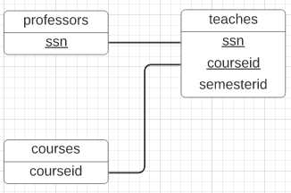
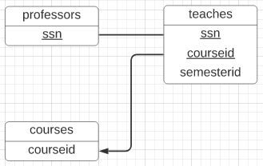
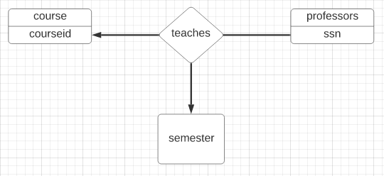

CSI2532 Playground

Arild Yonkeu Tchana
300123590

```bash
# psql -c "DROP DATABASE university"
psql -c "CREATE DATABASE university"
psql university -f ./db/schema.sql
psql university -f ./db/seed.sql
psql university -f ./db/test.sql
```

# Systêmes universitaire

## Diagramme ER

### Situation 1



```sql
CREATE TABLE professors (
    ssn int,
    PRIMARY KEY (ssn)
);

CREATE TABLE teaches (
    ssn int,
    courseid int,
    semesterid int,
    PRIMARY KEY (ssn, courseid)
);

CREATE TABLE courses (
    courseid int
);
```

### Situation 2



```sql
CREATE TABLE professors (
    ssn int
);

CREATE TABLE teaches (
    ssn int,
    courseid int,
    semesterid int
);

CREATE TABLE courses (
    courseid int
);
```

### Situation 3


```sql
CREATE TABLE professors (
    ssn int
);

CREATE TABLE teaches (
    ssn int,
    courseid int,
    semesterid int
);

CREATE TABLE courses (
    courseid int
);
```

### Situation 4



```sql
CREATE TABLE professors (
    ssn int
);

CREATE TABLE teaches (
    ssn int,
    courseid int,
    semesterid int
);

CREATE TABLE courses (
    courseid int
);
```
