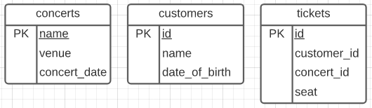
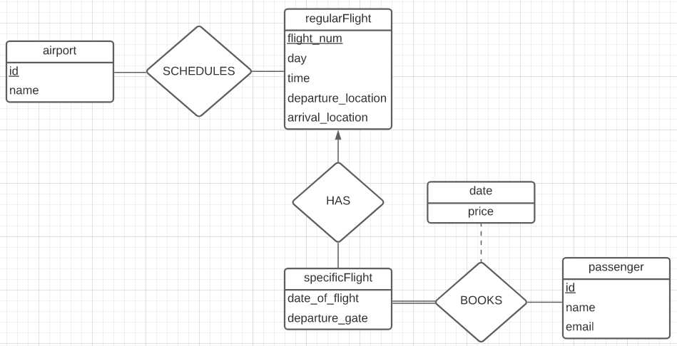

# CSI 2532 Mi-session

## Partie A: Billets de concert

### A1: Sorties SQL

a) 

| name | age |
| --- | --- |
| Rob | 23 |
| Roman | 10 |
| Winifred | 1 |

La sortie de cette requête montre les noms et l'age en ordre décroissant de tous les clients qui ont un ticket pour voir le concert de Drake.

b) 

| name | concert_date |
| --- | --- |
| Cardi B | 2021-03-12 |
| Mabel | 2021-04-11 |
| Ariana Grande | 2021-05-26 |

La sortie de cette requête montre les noms et les dates des concerts qui commencent après le 3 mars 2021 en ordre croissant.

c) 

| artist | num |
| --- | --- |
| Drake | 3 |
| Weezer | 2 |
| Barney | 0 |
| Billie Eilish | 0 |

La sortie de cette requête montre les noms des concerts qui commence en janvier et leurs nombre de sièges.

### A2 Requêtes SQL

a)
```sql
SELECT name, venue, concert_date
FROM concerts
WHERE concert_date > NOW()
ORDER BY concert_date ASC;
```

b)
```sql
WITH concerts_sold_tickets (name, venue, date) AS
 (SELECT *
 FROM concerts)
SELECT name,
 count(tickets.seat) AS sold_tickets
FROM concerts_sold_tickets
LEFT JOIN tickets ON tickets.concert_id = name
GROUP BY name
ORDER BY sold_tickets;
```

c)
```sql
SELECT * FROM customers
ORDER BY name ASC;

SELECT * FROM customers
ORDER BY date_of_birth ASC;
```

d)
```sql
INSERT INTO concerts
VALUES ('Drake 2', 'GNAG', '2021-04-02');
```

e)
```sql
DELETE FROM concerts 
WHERE name = 'Jonas Brothers'
```

f)
```sql
UPDATE concerts
SET concert_date = '2021-03-05'
WHERE name = 'Billie Eilish'
```

### A3: Diagramme relationnel


## Partie B: Système aérienne Airline System

### B1: Modélisation E-R



### B2: Algèbre relationnelle

a)

b)