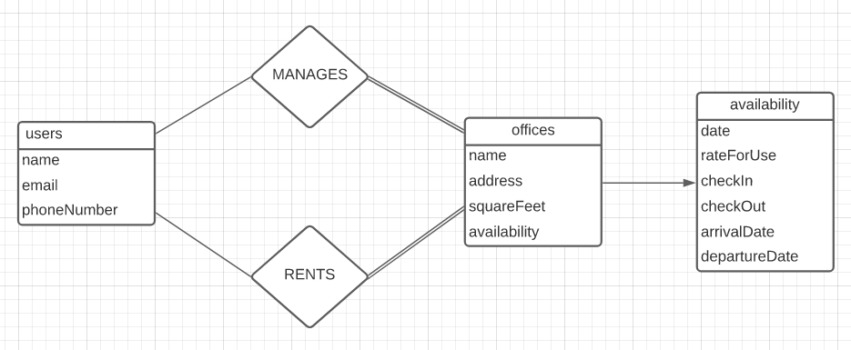
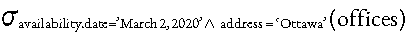
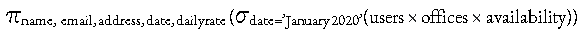

# Devoir #1

## Partie A: Modèles ER

### A1: Relations, cardinalité, et participation

a) 


b) 


c)


### A2: Conception du système



### A3: Algèbre relationnelle
a) 



b)



## Partie B: SQL

### B1: Lecture de requêtes SQL
a)

|name|experience|
|---|---|
|andrew|3|
|august|1|
|hayden|2|

b)

|name|released_date|
|---|---|
|MS Word|2011-01-20|
|Sketch|2016-06-15|

c)

La requête ne s'exécute pas parce qu'il manque "users_2019.id" dans la déclaration `GROUP BY`.

```sql
WITH users_2019 (id, name) AS
  (SELECT *
   FROM users
   WHERE join_date BETWEEN '2019-01-01' AND '2019-12-31')
SELECT id, 
       name,
       count(licenses.access_code) AS num 
FROM users_2019
LEFT JOIN licenses ON licenses.user_id = id
GROUP BY id, name
ORDER BY num DESC;
```

### B2: Écriture de requêtes SQL
a)

```sql
SELECT * FROM users
WHERE join_date < '2020-01-01'
```

b)

```sql
SELECT count(licenses.access_code) AS num_of_licenses, name
FROM users
LEFT JOIN licenses ON licenses.user_id = id
GROUP BY name
ORDER BY num_of_licenses DESC, name;
```

c)

```sql
INSERT INTO users (id, name, join_date)
VALUES
 (52, 'connor', '2021-01-02'),
 (53, 'floyd', '2021-01-01'),
 (54, 'khabib', '2021-02-01');

INSERT INTO licenses (user_id, software_name, access_code)
VALUES
 (52, 'MS PowerPoint', 'gdf657'),
 (53, 'MS PowerPoint', 'ghj453'),
 (48, 'MS PowerPoint', 'uil678'),
 (49, 'Photoshop', 'mht987'),
 (51, 'Photoshop', 'das523');
```

d)

```sql
UPDATE softwares
SET version = '51', released_date = '2020-01-01'
WHERE name = 'Sketch'
```

### B3: Mise à jour des schémas SQL
a)
b)
c)
d)
